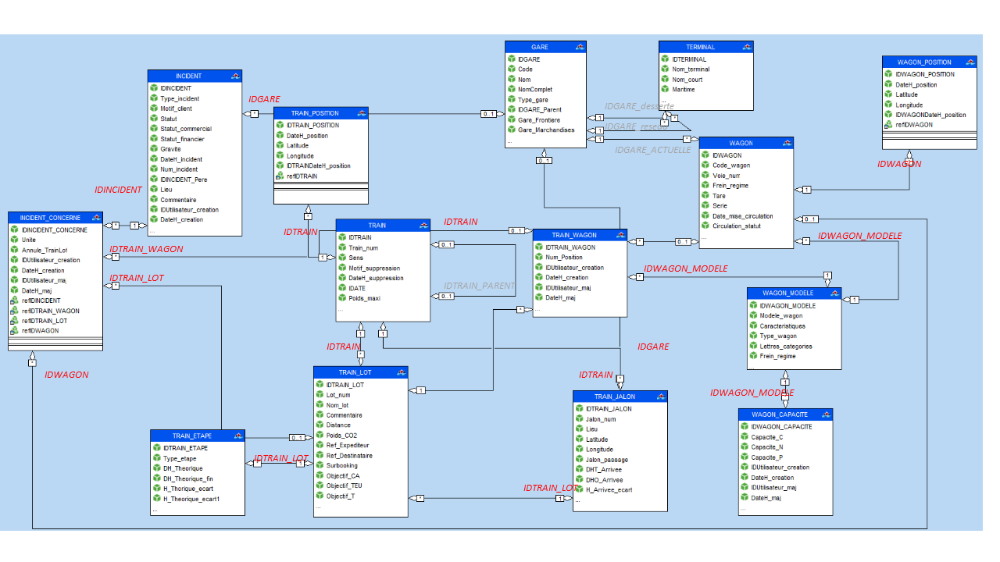

# CFL pipeline for ETL, modeling and prediction


## 📑 General

This repository is associated to the project "ANticipatory Train Optimisation with Intelligent maNagEment (ANTOINE)", under grant BRIDGES2020/MS/14767177/ANTOINE.

## 📂 Data

The data used in this project is provided by [CFL Multimodal](https://www.cfl-mm.lu/), and is based on the following data sources:



- **Data sources**:
The data sources are the different data providers that are used to feed the data portal. 
    - `INCIDENT`: Incidents occurring on the CFL network.
    - `INCIDENT_CONCERNE`: Motives of the incidents.
    - `STATION`: Stations of the CFL network.
    - `TERMINAL`: Terminals of the CFL network.
    - `TRAIN`: Trains travelling on the CFL network.
    - `TRAIN_ETAPE`: Steps of the trains.
    - `TRAIN_JALON`: Milestones of the trains.
    - `TRAIN_LOT`: Lots of the trains.
    - `TRAIN_POSITION`: Positions of the trains.
    - `TRAIN_WAGON`: Wagons of the CFL network interacting with the trains.
    - `WAGON`: Wagons of the CFL network.
    - `WAGON_CAPACITE`: Capacities of the wagons.
    - `WAGON_POSITION`: Positions of the wagons.
<br/>
     
- **Data Extraction**:
The data extraction is performed using Python as main programming language, and as the current data is in .xlsx format, a custom_operator `ExcelToPostgresOperator` is used to extract the data from the .xlsx files and load it into a [PostgreSQL](https://www.postgresql.org/) database.
<br/>

- **Data Transformation**:
The data transformation is performed using queries in [SQL](https://en.wikipedia.org/wiki/SQL) language, and the transformation is performed to create the tables necessary for the data model.
<br/>

- **Data Loading**:
After transforming the data, the data is loaded into the PostgreSQL database.
<br/>

- **Training model**:
The training of the model is performed using [Python](https://www.python.org/) and [scikit-learn](https://scikit-learn.org/stable/) library. The model is trained using the data from the PostgreSQL database, and the model is saved in a .pkl file.
<br/>

- **Prediction**:
The prediction is performed using [Python](https://www.python.org/) and [scikit-learn](https://scikit-learn.org/stable/) library. The prediction is performed using the model saved in the .pkl file, and the prediction is saved in a .csv file.
<br/>

The entire pipeline is containerized using [Docker](https://www.docker.com/), and it is orchestrated using [Apache Airflow](https://airflow.apache.org/).
Finally, all the resources are stored in a [GitHub](https://github.com/jdpinedaj/CFLDelays_airflow) repository.

## 📚 Workflows
There are four workflows in the data portal:

- **workflow_creating_tables**: This workflow creates the tables in the PostgreSQL database.

- **workflow_processing_training**: This workflow processes the data, trains the model and saves it in a .pkl file. It also predicts the delays and saves them in a .csv file.

- **workflow**: This is just a workflow that runs the two previous workflows.

The explanation of the workflows can be found in the research paper we published [here](https://doi.org/10.1016/j.engappai.2023.106222) and can be found here:
[research_paper.pdf](readme-resources/paper.pdf)


## 💾 Running Airflow on Docker

#### 1. docker-compose.yaml

To deploy Airflow on Docker Compose, you should fetch docker-compose.yaml.

```
curl -LfO 'https://airflow.apache.org/docs/apache-airflow/2.6.0/docker-compose.yaml'
```

In addition, please include the following element in the postgres service:

```
    ports:
        - "5432:5432"
```

#### 2. Initializing environment

On Linux, the quick-start needs to know your host user id and needs to have group id set to 0. Otherwise the files created in dags, logs and plugins will be created with root user. You have to make sure to configure them for the docker-compose:

```
mkdir -p ./dags ./logs ./plugins ./config
echo -e "AIRFLOW_UID=$(id -u)" > .env
```

#### 3. Initialize the database

First, start docker desktop. 

- On Windows, you just need to start Docker Desktop.


- On Linux, you need to enable docker-desktop service:
    
```
systemctl --user enable docker-desktop
```

Then, on all operating systems, you need to run database migrations and create the first user account. To do it, run.

```
docker-compose up -d airflow-init
```

#### 4. Cleaning-up the environment

The docker-compose we prepare is a “Quick-start” one. It is not intended to be used in production and it has a number of caveats - one of them being that the best way to recover from any problem is to clean it up and restart from the scratch.

The best way to do it is to:

- Run docker-compose down --volumes --remove-orphans command in the directory you downloaded the docker-compose.yaml file
- remove the whole directory where you downloaded the docker-compose.yaml file rm -rf '<DIRECTORY>'
- re-download the docker-compose.yaml file
- re-start following the instructions from the very beginning in this guide

#### 5. Running Airflow

Now you can start all services:

```
docker-compose up -d
```

#### 6. Extending the image to include custom packages after initialization of the database

If you want to install python requirements to the airflow container after the initialization of the database, you can do it by:

- adding the requirements to the *requirements.txt* file
- rebuilding the image docker-compose build by running `docker-compose build --no-cache`, after commenting and uncommenting the respective lines at the beginning of the *docker-compose.yaml* file.
- restarting the containers by running `docker-compose up -d`

#### 7. Accessing the environment via a browser using the web interface

Check http://localhost:8080
Or http://host.docker.internal:8080


### 8. Airflow connection and Postgres Operator

In Airflow/Admin/Connections

- Conncection ID: postgres_default
- Connection type: postgres
- Host: postgres # or host.docker.internal
- Schema: cfl
- Login: airflow
- Password: airflow
- Port: 5432

#### 9. Reseting Docker to start again

In case you need to reinstall everything again, you just need to run:

```
docker-compose down --volumes --rmi all
```

Or, if you want to prune everything:

```
docker system prune
```

And then start again...

## More info

For more info, please visit:
https://airflow.apache.org/docs/apache-airflow/stable/start/docker.html
